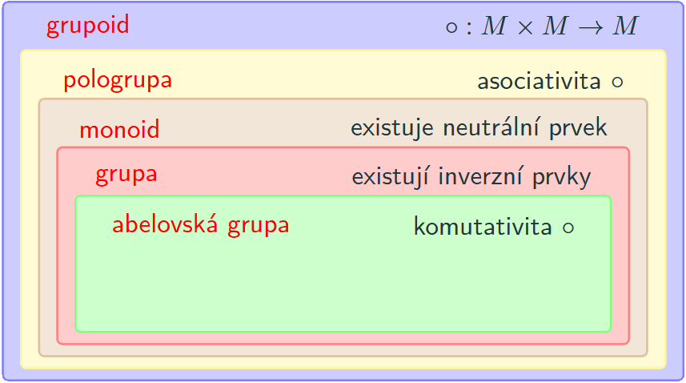

!!! example "[Příklad 1.8 ($(\mathbb{Q}, \circ)$ s aritmetickým průměrem je grupoid, ale ne pologrupa)](#ex-1.8)"

    ### $(\mathbb{Q}, \circ)$ s aritmetickým průměrem je grupoid, ale ne pologrupa {#ex-1.8}

    Uvažujme grupoid $(\mathbb{Q}, \circ)$, kde binární operace $\circ$ je definována jako aritmetický průměr:

    $$a \circ b := \frac{a+b}{2}.$$

    Pro racionální čísla $a, b$ je výraz $\frac{a+b}{2}$ opět racionální číslo, jde tedy o **grupoid**.

??? proof "Řešení příkladu 1.8"

    Aby šlo o pologrupu, musela by platit asociativita. Ukážeme protipříkladem, že neplatí:

    $$(2 \circ (-2)) \circ 4 = 0 \circ 4 = 2, \qquad \text{ale} \qquad 2 \circ ((-2) \circ 4) = 2 \circ 1 = \frac{3}{2}.$$

    Asociativní zákon tedy pro tuto operaci neplatí a nejedná se o pologrupu. Z toho je již jasné, že $(\mathbb{Q}, \circ)$ není ani monoid, ani grupa.

!!! example "[Příklad 1.9 ($(\mathbb{R}^+, \circ)$ je pologrupa, ale ne monoid)](#ex-1.9)"

    ### $(\mathbb{R}^+, \circ)$ je pologrupa, ale ne monoid {#ex-1.9}

    Uvažujme grupoid $(\mathbb{R}^+, \circ)$, kde $\mathbb{R}^+ = (0, +\infty)$ a binární operace $\circ$ je definována jako

    $$a \circ b := \frac{a \cdot b}{a+b}.$$

??? proof "Ověření asociativity (jde o pologrupu)"

    $$
    (a \circ b) \circ c = \frac{ab}{a+b} \circ c = \frac{\dfrac{ab}{a+b}\cdot c}{\dfrac{ab}{a+b}+c} = \frac{abc}{ab + c(a+b)} = \frac{a \cdot bc}{a(b+c) + bc} = \frac{a \cdot \dfrac{bc}{b+c}}{a + \dfrac{bc}{b+c}} = a \circ \frac{bc}{b+c} = a \circ (b \circ c).
    $$

    Asociativní zákon platí, jedná se tedy o pologrupu.

??? proof "Neexistence neutrálního prvku (není monoid)"

    Neutrální prvek $e \in \mathbb{R}^+$ by musel pro všechna $a \in \mathbb{R}^+$ splňovat

    $$a \circ e = a \;\Rightarrow\; \frac{a \cdot e}{a+e} = a \;\Rightarrow\; a \cdot e = a\cdot(a+e) \;\Rightarrow\; e = a+e \;\Rightarrow\; 0 = a,$$

    což platí jen pro $a = 0 \notin \mathbb{R}^+$. Neutrální prvek tedy neexistuje a o monoid se nejedná.

!!! example "[Příklad 1.10 ($(\mathbb{R}, \cdot)$ je monoid, ale ne grupa)](#ex-1.10)"

    ### $(\mathbb{R}, \cdot)$ je monoid, ale ne grupa {#ex-1.10}

    Uvažujme grupoid $(\mathbb{R}, \cdot)$ s klasickým násobením reálných čísel.

    Asociativita násobení je známá vlastnost, jde tedy o **pologrupu**.

    Neutrální prvek existuje — je jím číslo $1$, neboť $(\forall a \in \mathbb{R})(1 \cdot a = a \cdot 1 = a)$. Jde tedy dokonce o **monoid**.

    Inverzní prvek $a^{-1}$ splňující $a \cdot a^{-1} = a^{-1} \cdot a = 1$ však existuje pouze pro $a \neq 0$; pro $a = 0$ neexistuje. O **grupu** se tedy nejedná.

{ align=center }
---

!!! Implication "[Důsledek 1.1 (Ostrá hierarchie)](#implication-1.1)"

    ### Ostrá hierarchie {#implication-1.1}

    Z definic plyne, že každá grupa je monoid, každý monoid je pologrupa a každá pologrupa je grupoid:

    $$\text{grupoid} \supseteq \text{pologrupa} \supseteq \text{monoid} \supseteq \text{grupa}.$$

    Díky Příkladům [1.8](#ex-1.8)–[1.10](#ex-1.10) můžeme tuto hierarchii zpřesnit — našli jsme totiž grupoid, který není pologrupou, pologrupu, která není monoidem, a monoid, který není grupou:

    $$\text{grupoid} \supset \text{pologrupa} \supset \text{monoid} \supset \text{grupa}.$$

Na grupoid, pologrupu, monoid atd. se lze dívat jako na abstraktní matematickou třídu, pro kterou je definována neprázdná množina a binární operace s danými vlastnostmi. Ukážeme-li pro konkrétní dvojici $(M, \circ)$, že je např. monoidem, "zdědí" tím automaticky všechna tvrzení dokázaná obecně pro monoidy, aniž bychom je museli dokazovat znovu.
