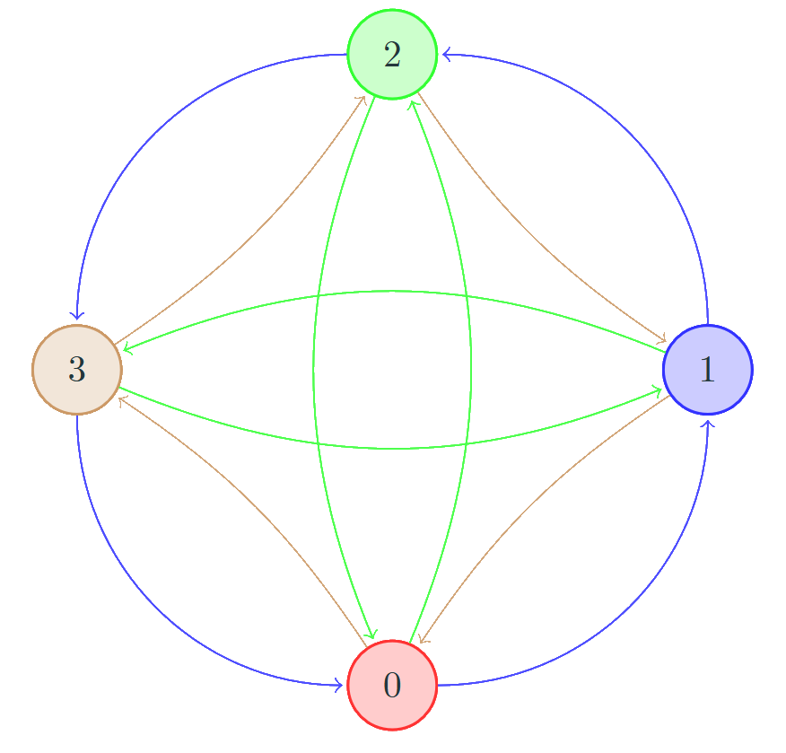

Pokud má množina $M$ z dvojice $(M, \circ)$ konečný počet prvků, lze její strukturu (danou operací $\circ$)
kompletně zachytit v tzv. Cayleyho tabulce, jejíž konstrukce je zřejmá z následujícího příkladu.

!!! example "[Příklad 1.9 (Grupa $\mathbb{Z}^{+}_4$)](#exc-1.9)"

    ### Grupa $\mathbb{Z}^{+}_4$ {#exc-1.9}

    Jelikož má nosič této grupy 4 prvky, bude mít Cayleyho tabulka 4 řádky a 4 sloupce
    označené těmito čtyřmi prvky (takže bude typicky znázorněná jako tabulka 5x5)

    | $+_4$ | 0 | 1 | 2 | 3 |
    |-------|---|---|---|---|
    | 0     | 0 | 1 | 2 | 3 |
    | 1     | 1 | 2 | 3 | 0 |
    | 2     | 2 | 3 | 0 | 1 |
    | 3     | 3 | 0 | 1 | 2 |

    Nyní do pole na řádku $m$ a v sloupci $n$ vyplníme výsledek $m +_4 n = m + n\text{ (mod } 4)$. Například do
    řádku 2 a sloupce 3 vyplníme $2 + 3\text{ (mod } 4) = 1$

Cayleyho tabulka skýtá o dané množině a operaci veškeré informace. Některé vlastnosti lze z tabulky
vyčíst velmi snadno, jiné už hůře:

- **Uzavřenost množiny** $M$ vůči operaci $\circ$ poznáme tak, že všechny pole tabulky obsahují prvky z množiny $M$.
- **Asociativitu operace** z tabulky poznáme těžko (projděte všechny trojice prvků a ověřte splnění asociativity…).
- **Neutrální prvek** $e$ v tabulce poznáme tak, že v ”jeho“ řádku a sloupci se přesně opakuje záhlaví řádku a sloupce tabulky.
- **Inverzní prvek** k prvku $a$ najdeme tak, že najdeme v příslušně označeném řádku a sloupci neutrální prvek $e$; sloupec tohoto políčka určuje $a^{−1}$.
- Operace je **komutativní**, pokud je tabulka symetrická vůči hlavní diagonále.

!!! Definition "[Definice 1.9 (Latinský čtverec)](#def-1.9)"
    
    ### Latinský čtverec $n$ {#def-1.9}

    **Latinský čtverec** pro *n*-prvkovou množinu $M$ je matice velikosti $n \times n$ taková, že v každém řádku
    i sloupci jsou vždy všechny prvky množiny $M$. (Tedy se žádný prvek v žádném řádku ani sloupci neopakuje)

!!! Theorem "[Věta 1.7 (Grupa a latinský čtverec)](#theorem-1.7)"

    ### Věta 1.7 Grupa a latinský čtverec {#theorem-1.7}

    Cayleyho tabulka každé grupy tvoří latinský čtverec.

    **Neplatí** ale, že každý latinský čtverec je Cayleyho tabulkou grupy.

!!! Theorem "[Věta 1.8 (O dělění v grupě)](#theorem-1.8)"

    ### Věta 1.8 O dělění v grupě {#theorem-1.8}

    V každé grupě lze jednoznačně dělit. 

    Tedy v každé grupě $(M, \circ)$ mají pro libovolné $a,b \in M$ rovnice

    $$a\circ x = b \text{ a } y \circ a = b$$

    jediné řešení.

??? proof "Důkaz věty 1.8"
    
    Dokázali jsme již dříve, vizte [Větu 1.1](1.2_Úvod.md#theorem-1.1)

Lze ukázat, že grupa je pologrupa, ve které lze jednoznačně dělit, tzn. že jednoznačnost dělení zajišťuje
existenci neutrálního prvku a inverzních prvků, ovšem za předpokladu, že je operace asociativní!

??? proof "Důkaz předchozí věty 1.7"
    
    Dokážeme to sporem:

    - Předpokládejme, že tabulka nějaké grupy $(M, ◦)$ není latinský čtverec.
    - To znamená, že v nějakém řádku nebo sloupci se jeden prvek, označme jej $b$, opakuje dvakrát. Bez újmy na obecnosti předpokládejme, že je to v řádku $n$ ve sloupcích $m_1$ a $m_2$ ($m_1 \neq m_2$).

    - Z toho ale okamžitě vyplývá, že rovnice $n \circ x = b$ má dvě různá řešení $m_1$ a $m_2$, což je spor s větou 1.8!

Vizualizovat konečnou grupu $G = (M, \circ)$ lze dále pomocí Cayleyho orientovaného grafu $(V, E)$, kde

- vrcholy grafu $V$ jsou prvky grupy, tj. $V = M$,
- orientovaná hrana $(a, b)$ patří do $E$, právě když $b = a \circ c$ pro jisté $c \in N$

Množinu $N$ vhodně zvolíme předem (většinou neobsahuje neutrální prvek grupy $G$; typicky jde o
generující množinu, viz následující kapitoly). Hrany lze pro přehlednost obarvit podle příslušnosti k $c$.

Příkladem může být následující graf grupy $\mathbb{Z}_4^+$, kde

- Modré hrany označují $a +_4 1$
- Zelené hrany $a +_4 2$
- Oranžové hrany $a +_4 3$

{ align=center }
